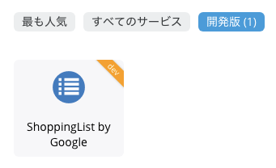
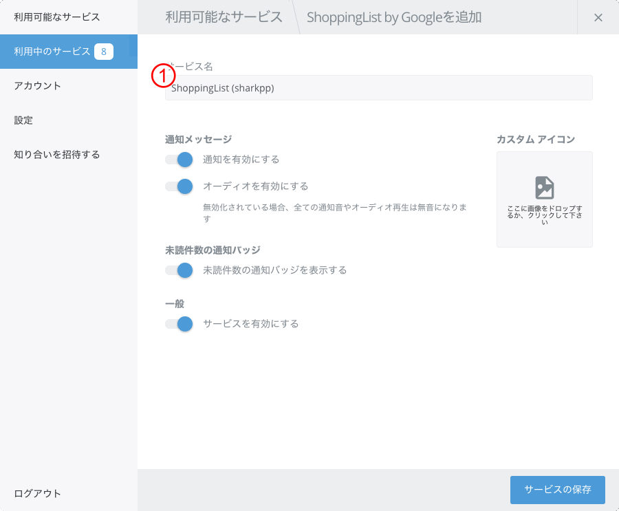
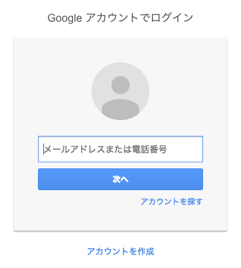

# Shopping List by Google for Franz 5

This is the [Franz](https://meetfranz.com/) 5 recipe for Shopping List by Google

## REQUIRED

* [Franz](https://meetfranz.com/) 5 or later
  Do not support older version.
* Google account

## HOW TO INSTALL

### DEVELOP VERSION

1. download the `franz-recipe-google-shoppinglist` folder.
2. Open the Franz Plugins folder on your machine (note **that this `dev` directory may not exist yet, and you must create it**):
  * Mac: `~/Library/Application Support/Franz/recipes/dev/`
  * Windows: `%AppData%\Franz\recipes\dev\`
  * Linux: `~/.config/Franz/recipes/dev`
3. Copy the `franz-recipe-google-shoppinglist` folder into the plugins directory
4. Reload Franz

See [Franz Recipe Documentation / Overview](https://github.com/meetfranz/plugins/blob/master/docs/integration.md)
 for details.

### STABLE VERSION

*Coming Soon ...*

## USAGE

### ADD NEW SERVICE

*develop version*

### SETTINGS

| # | field | description |
|-|-|-|
| (1) | service name | Please set freely |

### SIGN-IN

Please enter registered account information.

## LICENSE

&copy; 2019 sharkpp

This software is licensed under a [The MIT License](http://opensource.org/licenses/MIT).
